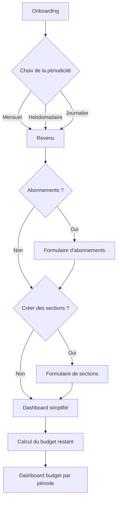

## 1. Schéma de flux utilisateur



---

## 2. Modèle de données

```ts
// src/models/Settings.ts
export type Period = 'DAY' | 'WEEK' | 'MONTH';

export interface Subscription {
  id: string;
  name: string;
  price: number;
}

export interface Section {
  id: string;
  name: string;
  budget: number;     // montant par période
}

export interface Settings {
  period: Period;
  revenue: number;       // montant fixe (mensuel, hebdo ou journalier)
  subscriptions: Subscription[];
  sections: Section[];
  carryOver: number;     // reliquat du mois précédent
}
```

---

## 3. Architecture et arborescence de fichiers

```text
src/
├── models/
│   ├── Settings.ts
│   ├── Subscription.ts
│   └── Section.ts
│
├── services/
│   ├── storageService.ts     # wrappers AsyncStorage/SQLite
│   └── budgetService.ts      # fonctions de calcul (÷ périodes, carryOver…)
│
├── screens/
│   ├── OnboardingScreen.tsx
│   └── DashboardScreen.tsx
│
├── components/
│   ├── FrequencySelector.tsx   # choix DAY/WEEK/MONTH
│   ├── RevenueInput.tsx        # champ revenu
│   ├── SubscriptionForm.tsx    # ajout/modif abonnements
│   ├── SectionsForm.tsx        # ajout/modif sections
│   └── BudgetOverview.tsx      # affichage du calcul et reliquats
│
└── navigation/
    └── AppNavigator.tsx       # gestion des écrans
```

---

## 4. Feuille de route

* [ ] **Onboarding** : intégrer `FrequencySelector` + `RevenueInput`, stocker dans `storageService`
* [ ] **Abonnements** : créer `SubscriptionForm`, gérer la liste et sauvegarde immédiate
* [ ] **Sections** : créer `SectionsForm`, budget par section selon périodicité
* [ ] **Calcul du budget** : implémenter `budgetService.calculateRemaining(settings)` et tester tous les scénarios
* [ ] **Dashboard** : développer `BudgetOverview` pour affichage du budget total, sections, abonnements et reliquats
* [ ] **Persistance & rollover** : à la fin de chaque période, calculer `carryOver`, mettre à jour `revenue`, reset sections/abonnements si besoin, sauvegarder

---

## 5. Conseils visuels

* **Outil** : dessine ce diagramme en grand (Miro, Figma, draw\.io) et utilise des post‑it pour chaque composant
* **Couleurs** :

  * 🔵 Bleu : écrans
  * 🟢 Vert : composants réutilisables
  * 🟠 Orange : services/métiers
* **Kanban** : déplace les post‑it en colonnes « To do / In progress / Done »
* **Wireframes rapides** : croquis de chaque écran avant d’écrire le JSX

---

Bon codage ! Tu as maintenant une vue d’ensemble claire et un plan de bataille visuel pour avancer pas à pas sans te perdre.
